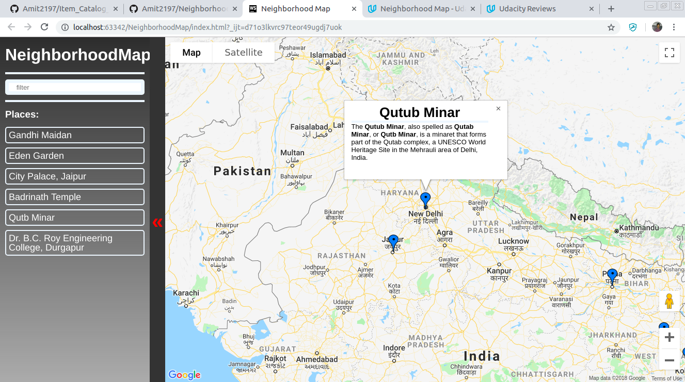

# NeighborhoodMap
Udacity NeighborhoodMap

## Content of Table

&emsp;[&#x261B;OverView](#overview)  
&emsp;[&#x261B;Installation](#installation)  
&emsp;[&#x261B;Tools and Functionality](#tools-and-functionality)  
&emsp;[&#x261B;Display Example](#display-examlple)    

## OverView
We will develop a single page application featuring a map of a neighborhood. There are many functionality like highlighted locations, bouncing marker, third-party data about those locations and various ways to browse the content.  

## Installation
+ Clone the [NeighborhoodMap](https://github.com/Amit2197/NeighborhoodMap) repository.
+ Run index.html in your browser.[live](https://amit2197.github.io/NeighborhoodMap/index.html)

## Tools and Functionality
There many tools usage like Api, Frameworks:
+ KnockoutJs
+ GoogleMap Api
+ Wikipedia Api
+ FourSquare Api
+ Ajax & Jquery

These have a lot of functionality:
+ Responsible Website.
+ There are six locations in the model.
+ Filtered text depend upon marker and listview.
+ list-view of location names is display all locations by default.
+ Clicking a location on the list displays unique information about the location, and bouncing its associated map marker.
+ Clicking a marker displays unique information about a location.
+ Markers animate when clicked or mouse over on marker.
+ marker infowindow give information about location.
+ All code are error-free
+ Infowindow heading taking from FourSquare Api api and content from Wikipedia api.
## Display Examlple
